# Cinefipedia

Cinefipedia te ayuda con la información que necesitas de tus películas favoritas y las que deseas poner en tu lista de pendientes.

## Desarrollado para
[Laboratoria](http://laboratoria.la)

***
### Objetivo
Crear un producto relacionado a películas respondiendo a las necesidades del usuario.

### Organización

1.- Identificamos temática y posibles oportunidades de mejora.

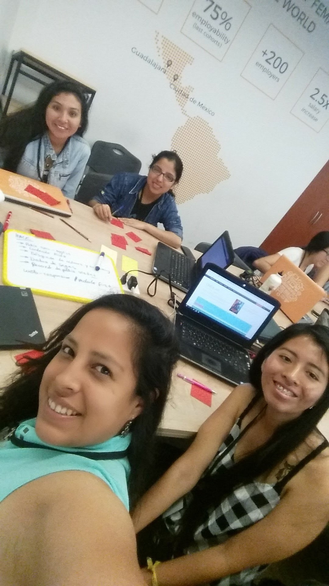

2.- Investigación en la diferentes páginas de contenido similar.

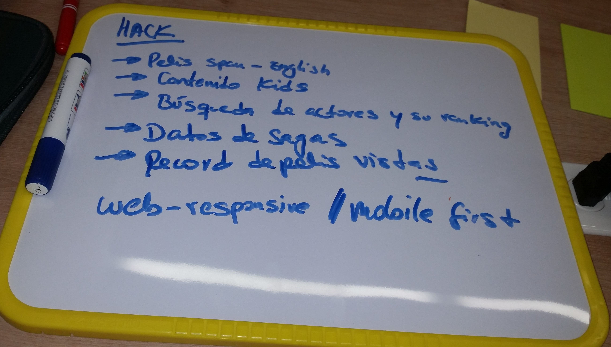

3.- Realizamos brainstorming para el funcionamiento de la página web con sketches y post-it.

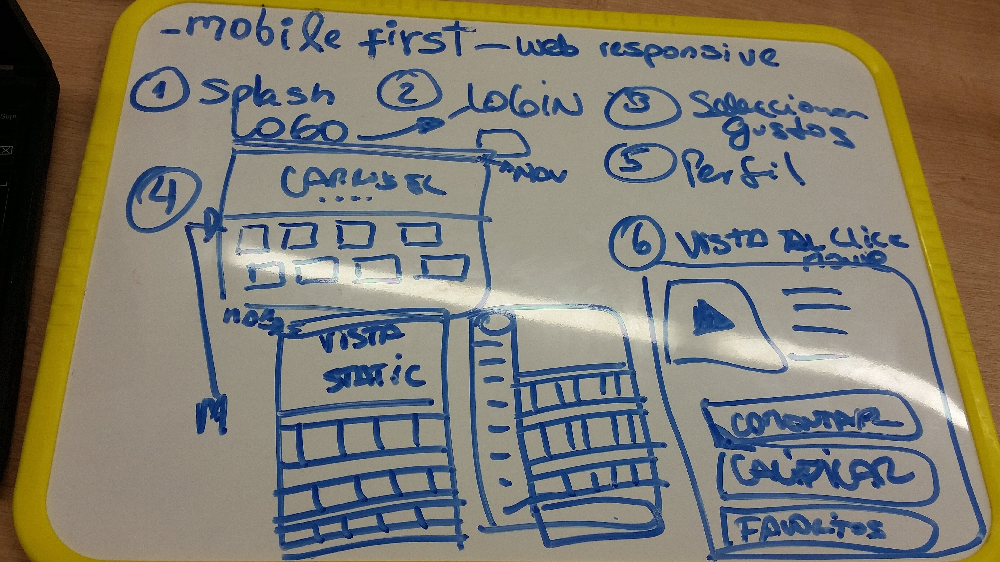

4.- Búsquedas y propuestas para el nombre de la página web.

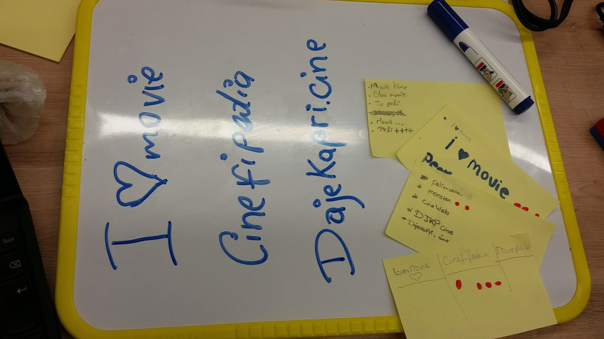

5.- Se realiza encuestas para identificar necesidas y datos relevantes para el contenido del producto.  

 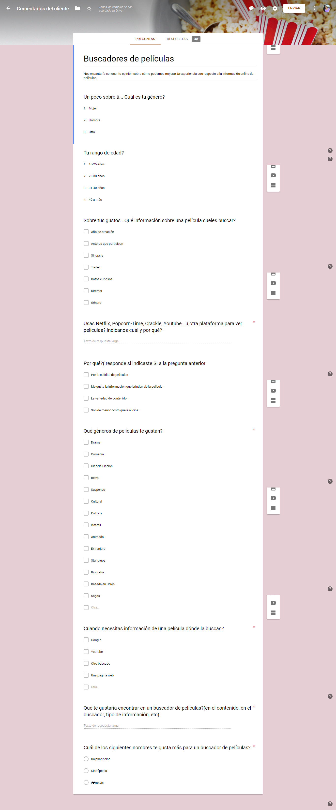

 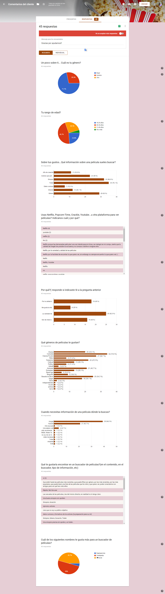

6.-  Organización y repartición de tareas en

 [trello](https://trello.com/b/93M6aCG5/hackaton-laboratoria-2018)

 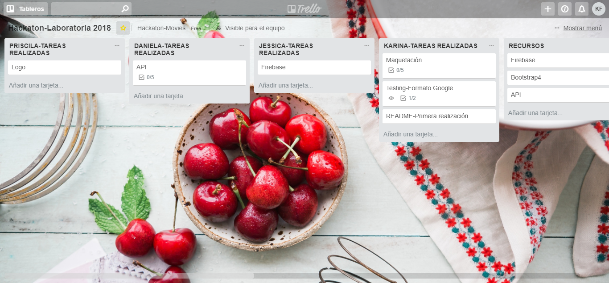

7.- Definición de herramientas a utilizar (Bootstrap 4, Firebase, API de contenido)

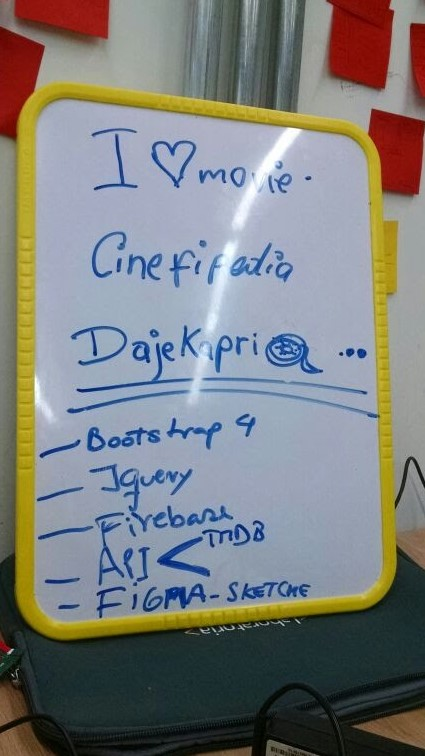

8.- Creación de GitHub colaborativo.

 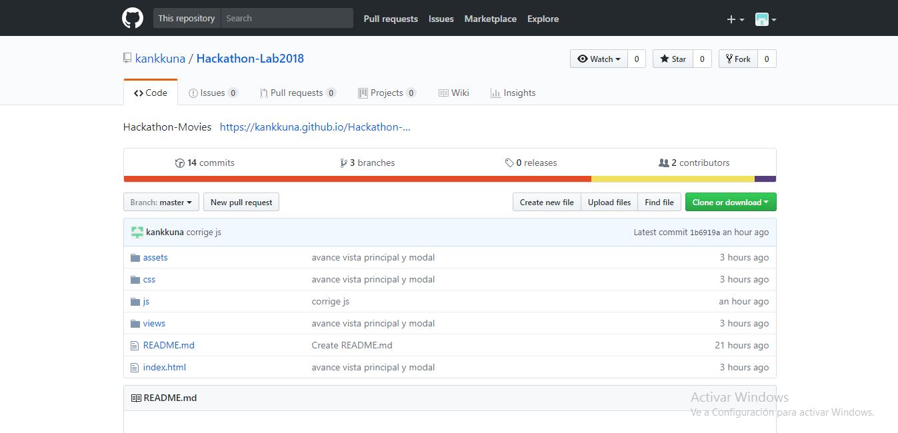

### ¿Qué se requiere?
 * Trabajar en grupo
 * Tener una planificación
 * La definición del diseño
 * Ventaja diferencial

### PLAN SKETCH

![Imagen 1][1]  ![Imagen 2][2]  ![Imagen 3][3]

 [1]: assets/docs/7.jpg
 [2]: assets/docs/8.jpg
 [3]: assets/docs/9.jpg

### Archivos adjuntos en repositorio

1. **Carpeta assets** contiene imagenes
2. **Carpeta app** contiene archivo app.js en el cuál se ecuentra el código de la función con el lenguaje Javascript.    
3. **archivo index.html** está vinculado con app.js, el usuario podrá acceder a la función mediante este archivo.
4. **README.md** contiene pseudocódigo de la función de la pagina web.

### Vistas de la pagina web
* SPLASH

 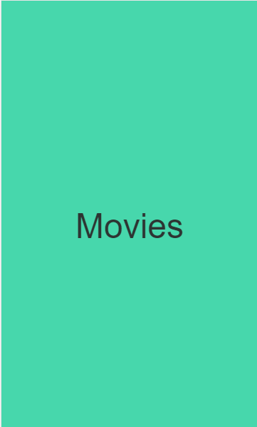

* VISTA HOME

 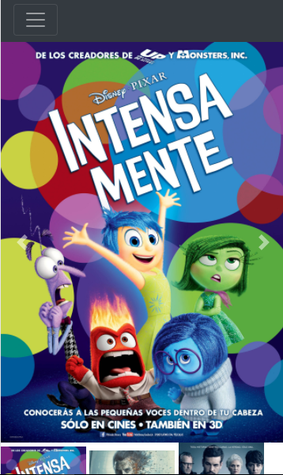

* SECCIÓN DE PELICULAS

 

* MENÚ DE HAMBURGUESA

 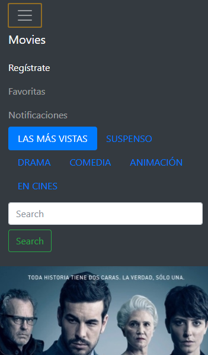

* SECCIÓN REGISTRARTE

 
#### Squad 1

* Karina Julissa Buhezo Flores
* Daniela Gonzales
* Priscila Rojas Urdanivia
* Jessica Manturano Paucar
